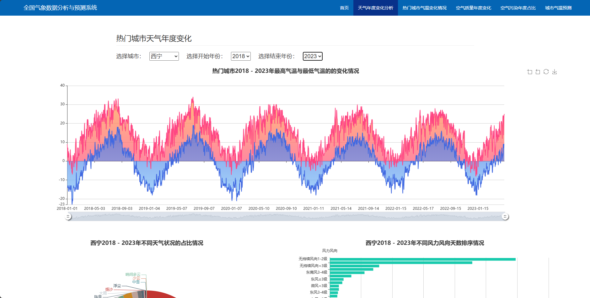
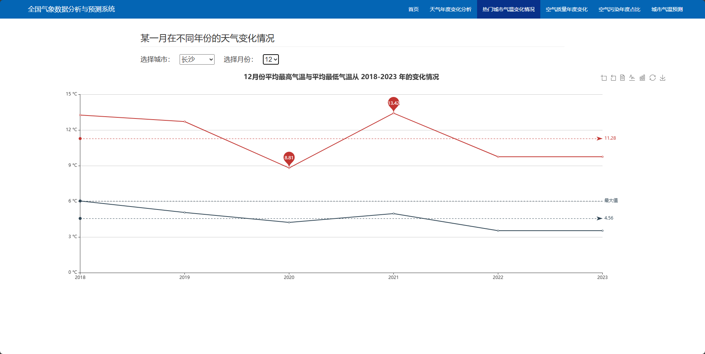
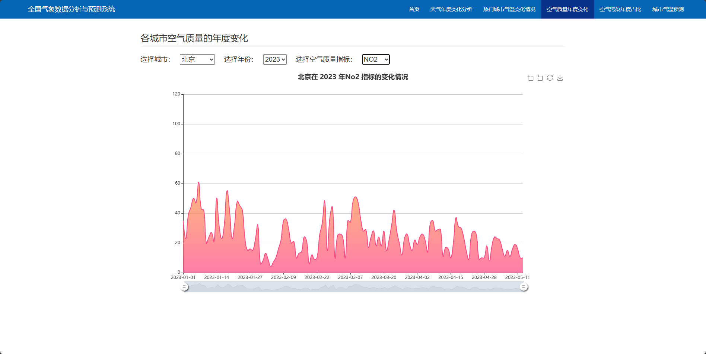
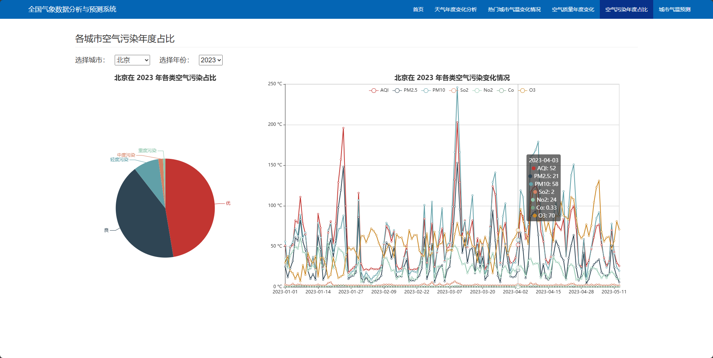
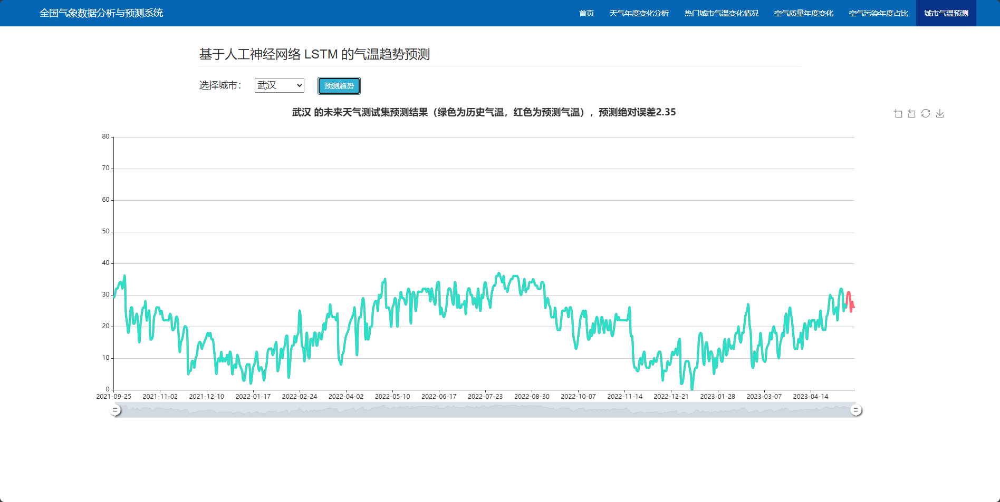

## 计算机毕业设计Python+大模型气象预测系统 气象数据分析 LSTM预测模型 时间序列分析自回归模型 ARIMA 天气大数据 天气可视化 气象爬虫 天气爬虫 大数据毕业设计

## 要求
### 源码有偿！一套(论文 PPT 源码+sql脚本+教程)

### 
### 加好友前帮忙start一下，并备注github有偿纯python气象预测
### 我的QQ号是2827724252或者798059319或者 1679232425或者微信:bysj2023nb

# 

### 加qq好友说明（被部分 网友整得心力交瘁）：
    1.加好友务必按照格式备注
    2.避免浪费各自的时间！
    3.当“客服”不容易，repo 主是体面人，不爆粗，性格好，文明人。
## 介绍
环境: python3、flask
简介: 需要定制项目+FU费源码查看主页【所有成品支持定制化修改、不用担心撞车】
本项目使用flask前后端一体开发，对天气数据进行可视化分析以及预测。
项目体色：天气数据爬虫、不同维度得天气数据可视化分析展示、天气数据预测。
算法：时间序列分析自回归模型(ARIMA)

## 演示视频
https://www.bilibili.com/video/BV1vmS9Y5EoB/

## 截图

